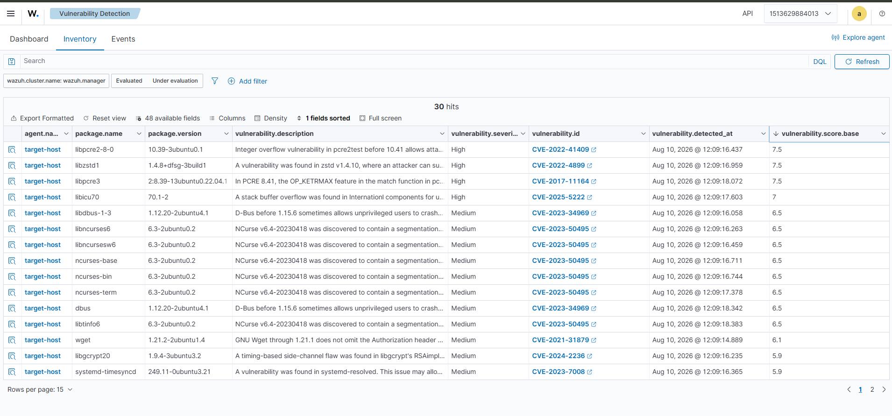

# Hallazgo: CVE-2022-41409 — Integer Overflow en libpcre2-8-0

## Contexto
Detectado por el módulo nativo de Vulnerability Detection de Wazuh (Syscollector),
escaneando el inventario de paquetes del agente `target-host`.

## Datos del hallazgo
- **Paquete afectado:** libpcre2-8-0
- **Versión instalada:** 10.39-3ubuntu0.1 (Ubuntu 22.04 jammy)
- **CVE:** CVE-2022-41409
- **Descripción:** Vulnerabilidad de integer overflow en pcre2test (versiones
  anteriores a 10.41), que permite denegación de servicio o impactos no
  especificados vía input negativo.
- **Versión corregida:** 10.41+

## Severidad (dos vectores, no uno solo)
| Fuente | CVSS v3.1 | Vector | Nota |
|---|---|---|---|
| NVD | 7.5 (High) | AV:N/AC:L/PR:N/UI:N/S:U/C:N/I:N/A:H | Asume escenario genérico de red |
| Amazon Linux | 3.3 (Low) | AV:L/AC:L/PR:N/UI:R | Reevaluado: pcre2test rara vez corre expuesto a red |

## Análisis de exposición real
`pcre2test` es una herramienta de testing de la librería PCRE2, no un servicio
que normalmente escuche en red. La discrepancia entre el score de NVD (genérico,
asume el peor caso) y el de Amazon (contextualizado al uso real) es un buen
ejemplo de por qué un analista no debe escalar un hallazgo solo por el número
de CVSS, por lo que se debe evaluar si el vector de ataque aplica al contexto real del
sistema. En este caso, salvo que algo invoque `pcre2test` con input de un
usuario no confiable, la explotabilidad práctica es baja.

## Evidencia

- Comando de verificación: `docker exec -it target-host apt list --installed | grep pcre2`

## Remediación
```bash
docker exec -it target-host apt-get update && apt-get install -y --only-upgrade libpcre2-8-0
```

## Conclusión
Hallazgo real, de explotabilidad baja en este contexto específico. Se documenta
como ejercicio de gestión de vulnerabilidades, priorizando por exposición real
y no solo por el score crudo del feed.
